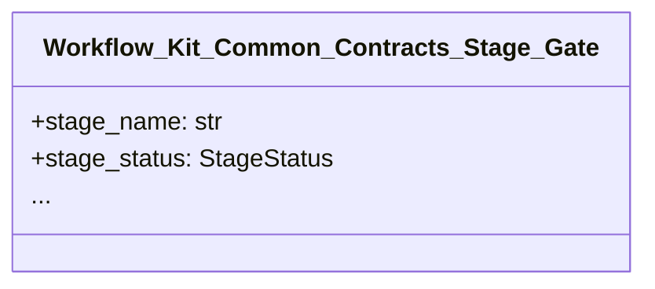

# Unit of Work 3-Layer Template (v0.7.0 step 9, AIDLC 차용)

- 문서 목적: standard_ai_workflow v0.7.0 step 9 의 UOW 3-layer template (AIDLC `inception/units-generation.md` 188 line 차용) 의 system-level / task-level / atom-level 분해 + dependency matrix + Mermaid graph.
- 범위: 3 layer (system / task / atom) + dependency matrix + story mapping + code organization
- 최종 수정일: 2026-06-13

## §1 TL;DR  {#s1-tldr}

| # | 항목 | 값 |
|---|---|---|
| 1 | 외부 spec | `workflow-source/templates/unit_of_work_template.md` (208 line, v0.7.0 stable) |
| 2 | 3 layer | system-level (분해) / task-level (의존성) / atom-level (코드 조직) |
| 3 | smoke test | `workflow-source/tests/check_unit_of_work_template.py` (414 line, 17 test PASS) |
| 4 | Source 1차 출처 | AIDLC `awslabs/aidlc-workflows/aidlc-rules/aws-aidlc-rule-details/inception/units-generation.md` (188 line, commit `b19c819`, 2026-06-08) |
| 5 | 도입 버전 | v0.7.0 (commit `c981cac`) |
| 6 | 관련 토픽 | [[topics/aidlc-benchmark-analysis-2026-06-12]] §4.2 G (Unit of Work 3-layer) |

## §2 왜 Unit of Work 3-Layer 가 필요한가  {#s2-why}

v0.6.4-7 의 mode 6종 (horizontal: analysis / design / implementation / validation / review / maintenance) + task-level (work_backlog) 의 *missing layer* 보강:
- system-level 분해 (mode 간) — 전체 시스템 분해 view
- task-level 의존성 (backlog item 간) — DAG + cycle detection
- atom-level 코드 조직 (function/class) — Mermaid graph

AIDLC 의 4종 (FD/NFR/NFRD/ID) 는 우리 사용 패턴 (단일 모듈 풀스택 generalist) 에 *과잉*. 3 layer 로 단순화.

## §3 3-Layer 구조  {#s3-3-layer}

| Layer | 분해 단위 | 표 형식 | 검증 |
|---|---|---|---|
| **System-level** | 전체 시스템 → 모듈 | module list + 책임 + interface | 1+ module, 책임 명시 |
| **Task-level** | task → atom | dependency matrix (N×N) | DAG, no cycle, no self-dep |
| **Atom-level** | atom → code | Mermaid class/module graph + story mapping | valid Mermaid syntax, UOW id 일관성 |

### 3.1 System-level 분해

- 모듈 (5종) + 책임 + 인터페이스
- 의존성: 화살표 (A → B = A depends on B)
- 1+ module, 책임 ≥ 1 줄, 인터페이스 ≥ 1

### 3.2 Task-level dependency matrix

```
        | task-1 | task-2 | task-3 |
task-1  |   -    |   D    |   .    |
task-2  |   .    |   -    |   D    |
task-3  |   .    |   .    |   -    |
```

- `D` = depends on
- `.` = no dependency
- `-` = self (no entry)
- **DAG 검증**: cycle detection (DFS), no self-dep

### 3.3 Atom-level Mermaid graph



## §4 Smoke test 17 test  {#s4-smoke-test}

- UOW 정의 parse (5): header / required fields / type enum / status enum / date format
- Dependency Matrix (5): parse / symmetry / no-self-dep / **cycle detection (DFS)** / DAG validation
- Mermaid Graph (2): block present / edge syntax
- Story Mapping (1): valid UOW id 참조
- Template 자체 정합성 (3): sections / related docs / AIDLC source
- 통합 (1): full parse 일관성

## §5 우리 사용 패턴 적응  {#s5-adaptation}

| AIDLC 패턴 | 우리 적응 | 비율 |
|---|---|---|
| 4종 (FD/NFR/NFRD/ID) | 3 layer (system/task/atom) | 75% |
| Per-Unit Design Loop (FD/NFR/NFRD/ID 4종 분화) | 단일 design mode (system-level 만) | — |
| NFR Design 별도 stage | Design mode 에 흡수 | — |

**N/A 처리**: AIDLC 의 4종 분화는 우리 사용 패턴 (단일 모듈 풀스택 generalist) 에 과잉. yklee 의 "1 session = 1 chapter" 패턴과 충돌.

## §6 한계 / 예외  {#s6-limitations}

- **Per-Unit Design Loop ❌**: 우리 사용 패턴에 N/A. 1 session = 1 chapter 가 정공법
- **NFR Design 별도 stage ❌**: Design mode 흡수
- **v0.8.0 follow-up**: UOW 기반 sub-agent 위임 자동화

## §7 Follow-up (v0.7.1+)  {#s7-followup}

- `workflow_kit.common.contracts.uow` 신규 (UOW matrix parsing + sub-agent 위임 결정 helper)
- `bootstrap_lib` 의 `--adoption-mode new` 가 unit_of_work.md 자동 emit
- v0.8.0: UOW 기반 sub-agent 위임 자동화 (보조 worker 자동 dispatch)

## §8 References  {#s8-references}

- 1차 출처: AIDLC `awslabs/aidlc-workflows/aidlc-rules/aws-aidlc-rule-details/inception/units-generation.md` (188 line, commit `b19c819`, 2026-06-08)
- 우리 SSOT: `workflow-source/templates/unit_of_work_template.md` (208 line)
- 우리 검증: `workflow-source/tests/check_unit_of_work_template.py` (17 test PASS)
- 우리 wiki: [[topics/aidlc-benchmark-analysis-2026-06-12]] §4.2 G
